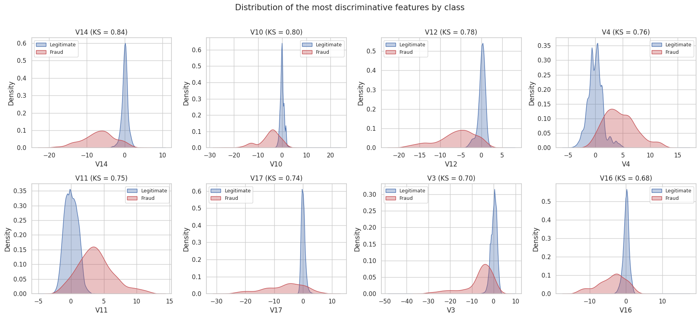
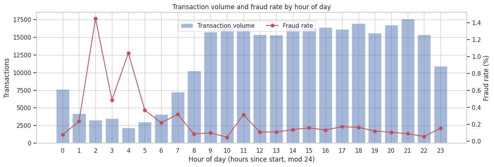
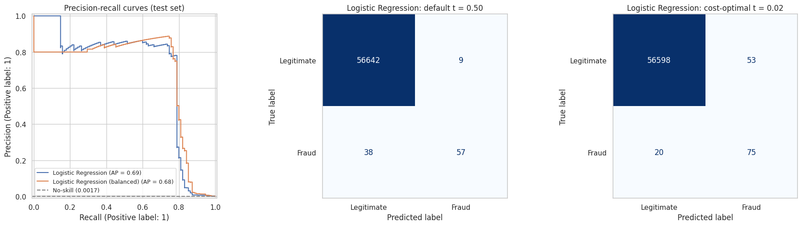

### Credit Card Fraud Detection under Extreme Class Imbalance

**Asit Kar**

#### Executive summary
Card fraud is rare (about 1 in 600 transactions in this dataset), but each missed fraud is expensive. This project builds a fraud classifier that is judged on business cost rather than accuracy. This initial report (Capstone 20.1) covers data cleaning, exploratory analysis, feature engineering and a **logistic regression baseline**.

The baseline reaches a **PR-AUC of 0.695** (a random model scores 0.0017). With the decision threshold tuned for a $200 missed-fraud / $5 false-alert cost matrix, it **catches 79% of fraud at 59% precision**. On the 56,746-transaction test set, that cuts the total cost from **$7,645 at the default 0.5 threshold to $4,265**, a 44% reduction. Doing nothing would cost $19,000.

#### Rationale
Credit card fraud costs the global banking industry more than $35 billion a year. Every point of recall gained prevents fraud losses, and every false positive removed takes friction away from genuine cardholders at the point of sale. Banks are also under regulatory pressure (PCI-DSS, PSD2, RBI guidelines) to show that automated fraud models are auditable and cost-aware. A model tuned for accuracy alone does not meet that need.

#### Research Question
Can a supervised machine learning model accurately tell fraudulent transactions from legitimate ones while keeping the total business cost of missed fraud (false negatives) and blocked legitimate customers (false positives) as low as possible? The model is trained on anonymised credit card transaction features and built to handle extreme class imbalance (~0.17% fraud).

#### Data Sources
[Credit Card Fraud Detection](https://www.kaggle.com/datasets/mlg-ulb/creditcardfraud) from the ULB Machine Learning Group (Kaggle). It contains 284,807 European card transactions made over two days in September 2013 and 30 features: `Time`, `Amount`, and `V1`–`V28` (PCA-anonymised). The binary target is `Class`, with 492 frauds (0.172%).

The CSV (~100 MB) is not committed to this repo. The notebook reads `data/creditcard.csv` if it exists and otherwise loads the file from a public GitHub mirror automatically.

#### Methodology
1. **Data cleaning.** Checked for missing values (none found). Removed **1,081 exact duplicate rows**, which left 283,726 transactions and 473 frauds. Ran validity checks on amounts and times.
2. **Outlier analysis.** Applied the IQR rule to every feature and measured the fraud-rate lift among the outliers. Outliers were **kept on purpose** because they carry the fraud signal.
3. **EDA.** Class-imbalance profiling, KS-statistic feature ranking, class-conditional KDE plots, amount-band and hour-of-day fraud rates, and correlation analysis.
4. **Feature engineering.** Added `log_amount`, `is_micro_amount` (≤ €1 card testing), `is_night`, and cyclical `hour_sin`/`hour_cos`. Dropped raw `Time` and `Amount`.
5. **Baseline modelling.** Split the data 80/20 with stratification. Built a scikit-learn `Pipeline` with `StandardScaler`. Compared a majority-class dummy against logistic regression, with and without `class_weight='balanced'`, using 5-fold stratified CV.
6. **Evaluation.** The **primary metric is PR-AUC**, supported by F2-score, ROC-AUC, confusion matrices and **expected cost** (FN = $200, FP = $5). The cost-optimal threshold was chosen on a validation split taken from the training data, so the test set was never used for tuning.

#### Results
**Data and EDA findings**
- Only 0.167% of transactions are fraud. A model that always predicts "legitimate" is 99.8% accurate but catches no fraud, so accuracy is not a usable metric here.
- The most discriminative features by KS statistic are **V14 (0.84), V10 (0.80), V12 (0.78), V4 (0.76), V11 (0.75) and V17 (0.74)**. This matches the expectation in the Module 16 proposal.
- **Outliers are the signal.** Transactions that are an IQR outlier on any of the top-5 outlier features make up 8.2% of all rows but contain **88.6% of all fraud**.
- Fraud clusters in **micro transactions of €1 or less** (0.56% fraud rate, 4.7× everything else) and in **night-time hours** (up to ~1.45% vs ~0.1–0.2% during the day).

**Baseline model (test set, 56,746 transactions, 95 frauds)**

| Model | Threshold | PR-AUC | Recall | Precision | F2 | Cost |
|---|---|---|---|---|---|---|
| Dummy (always legitimate) | – | 0.002 | 0% | – | 0.00 | $19,000 |
| Logistic Regression | 0.50 | 0.695 | 60.0% | 86.4% | 0.64 | $7,645 |
| Logistic Regression (balanced) | 0.50 | 0.679 | 87.4% | 5.5% | 0.22 | $9,500 |
| **Logistic Regression (baseline)** | **0.02 (cost-optimal)** | **0.695** | **78.9%** | **58.6%** | **0.74** | **$4,265** |
| Logistic Regression (balanced) | 0.96 (cost-optimal) | 0.679 | 80.0% | 46.9% | 0.70 | $4,230 |

**How to read these results.** PR-AUC measures how well the model ranks fraud above legitimate transactions, and the no-skill floor is the fraud rate (0.0017). A PR-AUC of about 0.70 means the baseline is far better than chance, though there is still room to improve. At the default threshold the model is precise but misses 40% of fraud. A missed fraud costs 40× as much as a false alert, so lowering the threshold to the cost-optimal value catches 18 more frauds for 44 extra alerts, and total cost falls by $3,380. The balanced and unweighted models end up at a similar cost once each one's threshold is tuned. The simpler unweighted logistic regression at t = 0.02 is the **baseline to beat in Module 24**.

#### Next steps
- Compare k-NN, Decision Tree, SVM-RBF, Random Forest and XGBoost (`scale_pos_weight`) with `GridSearchCV`, scored on PR-AUC.
- Evaluate resampling (RandomUnderSampler, SMOTE, ADASYN) inside `imblearn` pipelines so that resampling only touches the training folds.
- Re-tune the cost-optimal threshold for each model and report the dollar savings against this baseline.
- Use tree-model feature importances to confirm the V14/V10/V12/V17 ranking, and test whether the engineered time and amount flags add non-linear value.
- Write a model card and a plain-English threshold recommendation for non-technical stakeholders.

#### Outline of project

- [Initial report — EDA and baseline model (notebook)](notebooks/fraud_detection_eda_baseline.ipynb)
- [Summary of findings (Word document)](Capstone_20.1_Summary_of_Findings.docx)
- `images/`: figures exported from the notebook

##### Contact and Further Information
Asit Kar · Post Graduate Program in AI and Machine Learning (UC Berkeley Executive Education / Emeritus)
